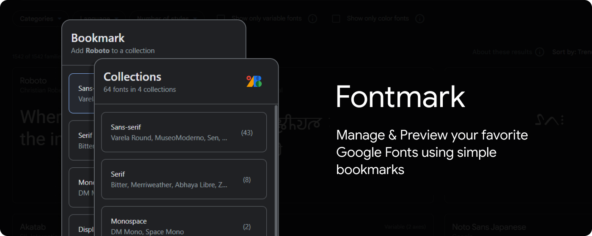

<h1></h1>

Manage & preview your favorite Google Fonts using bookmarks.

Each collection is a simple bookmark where you can add as many fonts as you like. These collections of fonts can be previewed in a single page on Google Fonts website.

> I used to bookmark my favorite Google fonts individually, but it quickly became tedious to go through them one by one when I needed to choose one for a project.
>
> Luckily, the Google Fonts website has a feature to preview a group of fonts for sharing, which gave me the idea to create a bookmark manager that keeps track of my font collection using just a handful of bookmarks.

## Usage

Bookmark collections are initially saved in a folder named "Fonts", but it can be moved anywhere else. You can also view or edit the collections from anywhere.

To add or remove a font from a collection, visit the Google font's page such as [/Roboto](https://fonts.google.com/specimen/Roboto) and use the extension menu.

You can also import all fonts from a collection to another or remove them from an existing collection if you are open the collection preview page such as [this](https://fonts.google.com/share?selection.family=Roboto|Open+Sans|Lato) on Google Fonts website.

## Build

1. [Download this repo](https://github.com/ni554n/fontmark/archive/refs/heads/main.zip) and extract it somewhere permanent
2. Run `npm install` and `npm run build`
3. Go to [Chrome Extensions](chrome://extensions/) page and enable `Developer Mode` from the top right corner
4. Click `Load Unpacked` button and select the extracted _**fontmark-main**_ folder

## Information

**Author:** [Nissan Ahmed](https://anissan.com) ([@ni554n](https://twitter.com/ni554n))

**Donate:** [PayPal](https://paypal.me/ni554n)

